# Filling the grid

A container of fixed width and height $w, h \in \R^+$ is filled with $n \in \N$ (natural numbers without $0$) squares positioned in a grid-like fashion. The squares should cover as much of the $w \times h$ area as possible without overflowing, which means we must maximize the side length $S \in \R^+$ of the square. In other words, we are searching an $b \times a \in \N^2$ grid which fits all our $n$ squares and itself fits in the container while either being as wide or as tall as the container.

We can state the problem in a formal manner as follows:

$$\begin{gather*}
\text{Sol}_{a} \coloneqq \Set{s \in \R^{+} | \exists a, b \in \N \thickspace . \thickspace n \leq ab \land as = w \land bs \leq h} \\
\text{Sol}_{b} \coloneqq \Set{s \in \R^{+} | \exists a, b \in \N \thickspace . \thickspace n \leq ab \land bs = h \land as \leq w} \\
\text{Sol} \coloneqq \text{Sol}_{a} \cup \text{Sol}_{b} \\
S \coloneqq \max \text{Sol} \end{gather*} $$

Let's start solving for a solution $s_a \in \text{Sol}$ by attempting to find a grid as wide as the container. For any $s \in \text{Sol}_{a}$:

$$\begin{align*}n \leq ab \land as = w \land bs \leq h &\implies n \leq \frac{w}{s}b \land bs \leq h \\ &\implies n \leq \frac{w}{s} \cdotp \frac{h}{s} \\ &\implies n \leq \frac{wh}{s^2} \\ &\implies s \leq \sqrt{\frac{wh}{n}} \tag{1} \end{align*}$$

This is an upper bound on the side length. Let's determine the grid's number of columns, $a$:

$$\begin{align*} as = w \implies &a = \frac{w}{s} \\ \overset{(1)}{\implies} &a \geq \frac{w}{\sqrt{\frac{wh}{n}}} \\ \implies &a \geq \sqrt{\frac{w}{h}n} \\ (s \text{ maximized} \land a \in \N) \implies &a = \left\lceil\sqrt{\frac{w}{h}n}\right\rceil \tag{2} \end{align*}$$

To further clarify the last step: since $s$ is in the denominator, maximizing it means $a$ must take the smallest value greater than or equal to RHS. Since $a \in \N$ this is precisely RHS rounded up.

Knowing $a$ we can now determine the side length $s$:

$$\begin{equation}\tag{3} as = w \implies s = \frac{w}{a} \end{equation}$$

Since the implications in $(1)$ go in one direction only, we must check that $s \in \text{Sol}$. The first necessary condition is:

$$\begin{equation}\tag{4} n \leq \left\lfloor \frac{w}{s} \right\rfloor \cdotp \left\lfloor \frac{h}{s} \right\rfloor \end{equation}$$

since $a = \left\lfloor w/s \right\rfloor$ and $b = \left\lfloor h/s \right\rfloor$ provide the number of squares the grid _should_ have on each dimension, if it fits the squares and doesn't overflow. Moreover, $as = w \implies a = w/s = \left\lfloor w/s \right\rfloor$, since $a \in \N$.

Let's go to our initial assumptions.

$$\begin{equation}\tag{5} n \leq ab \land bs \leq h \implies n \leq a \frac{h}{s} \\ \implies \underbrace{n \leq a \left\lfloor \frac{h}{s} \right\rfloor}_{\text{(i)}} \lor \underbrace{(n > a \left\lfloor \frac{h}{s} \right\rfloor \land n \leq a \frac{h}{s})}_{\text{(ii)}} \end{equation}$$

In case $\text{(i)}$ we can take $b = \left\lfloor h/s \right\rfloor$, which means $bs \le h$. Thus, $s$ as determined above is in $\text{Sol}_{a} \sube \text{Sol}$. But in case $\text{(ii)}$, $b = \left\lfloor h/s \right\rfloor \implies n > ab \implies s \notin \text{Sol}$. A new solution $s'$ must be found.

Let's analyze what follows from $\text{(ii)}$:

$$\begin{align*} a \left\lfloor \frac{h}{s} \right\rfloor < n \leq a \frac{h}{s} \implies &\left\lfloor \frac{h}{s} \right\rfloor < \frac{h}{s} \land n \leq a \frac{h}{s} \\ \implies &\frac{h}{s} < \left\lceil \frac{h}{s} \right\rceil \land n \leq a \frac{h}{s} \\ \implies &n < a \left\lceil \frac{h}{s} \right\rceil \tag{6} \end{align*}$$

This means $b = \left\lceil h/s \right\rceil$ is a safe choice for the $a$ that we've determined, and a candidate for $s'$ is:

$$\begin{equation} \tag{7} s' = \frac{h}{b} = \frac{h}{\left\lceil \frac{h}{s} \right\rceil} \overset{(3)}{=} \frac{h}{\left\lceil \frac{h}{w}a \right\rceil} \end{equation}$$

Is this $s' \in \text{Sol}$? Yes, in fact in $\text{Sol}_{b}$: $(6) \implies n \leq ab$, $(7) \implies bs' = h$ and

$$\begin{equation} \tag{8} as' = \frac{ah}{\left\lceil \frac{h}{w}a \right\rceil} = \frac{ah}{\left\lceil \frac{ah}{w} \right\rceil} \overset{\left\lceil x \right\rceil \geq x}{\implies} as' \leq \frac{ah}{\frac{ah}{w}} \implies as' \leq w \end{equation}$$

With that we have determined $s_a$. Here's its formula based only on inputs $w, h, n$:

$$\begin{gather*} a = \left\lceil\sqrt{\frac{w}{h}n}\right\rceil \qquad s_a = \begin{cases} \frac{w}{a} &\text{if } n \leq a \left\lfloor \frac{h}{w}a \right\rfloor \\ \frac{h}{\left\lceil \frac{h}{w}a \right\rceil} &\text{else} \end{cases} \end{gather*}$$

Analoguously goes the process for determining $s_b$, whose formula is:

$$\begin{gather*} b = \left\lceil\sqrt{\frac{h}{w}n}\right\rceil \qquad s_b = \begin{cases} \frac{h}{b} &\text{if } n \leq b \left\lfloor \frac{w}{h}b \right\rfloor \\ \frac{w}{\left\lceil \frac{w}{h}b \right\rceil} &\text{else} \end{cases} \end{gather*}$$

Finally, $S = \max \Set{s_a, s_b}$.

Sadly, this algorithm sometimes fails to find the optimal solution. For example, inputs: 
- $w = 10, h = 2, n = 8$ expect $S = 1.25$ but this algorithm gives $S = 1$
- $w = 7, h = 2, n = 20$ expect $S = 0.7$ but this algorithm gives $S = 0.(6)$
- and many others

What do these inputs have in common? When does this algorithm have issues?

To investigate this, let's simplify our solution statement. Observe that:

$$\begin{equation} \tag{9}
\begin{split}
s_w \in \text{Sol}_a \iff &as_w = w \land bs_w \le h \iff a \ge rb \land s_w = \frac{w}{a_w} \\
s_h \in \text{Sol}_b \iff &bs_h = h \land as_h \le w \iff rb \ge a \land s_h = \frac{h}{b_h} \\
&\text{with } n \le ab \text{ for all of the above}
\end{split}
\end{equation}$$

We've simplified width and height to just their ratio, $r = \frac{w}{h}$. Moreover, we don't need the side lengths themselves to compare them. Let $s_w = \frac{w}{a_w}$, $s_h = \frac{h}{b_h}$. Then: 

$$\begin{equation} \tag{10}
s_w \gt s_h \iff \frac{w}{a_w} \gt \frac{h}{b_h} \iff \frac{1}{a_w} \gt \frac{1}{rb_h} \iff a_w \lt rb_h
\end{equation}$$

We can now state the final solution:

$$\begin{equation} \tag{11}
\begin{split}
a_w &= \min \Set{a \in \N : \exist b_w \text{ . } a \ge \frac{n}{b_w} \land a \ge rb_w} \\
b_h &= \min \Set{b \in \N : \exist a_h \text{ . } b \ge \frac{n}{a_h} \land b \ge \frac{a_h}{r}} \\
s &= \begin{cases}
    s_w = \frac{w}{a_w} &\text{ if } a_w < rb_h, \\
    s_h = \frac{h}{b_h} &\text{ otherwise} 
\end{cases}
\end{split}
\end{equation}$$

The problem is reduced to just $a, b$ and $r$. This simplification unlocks a powerful geometric representation in the 2D plane: we're looking for points $(a_w, b_w), (a_h, b_h) \in \N^2$ such that they're on or above the hyperbola $xy = n$ while accounting for their position relative to the line $x = ry$. $x = a$ is used as stand-in for columns in the continuous space, $y = b$ for rows. Take a look (graph A):

<p id="graph-a" align=center>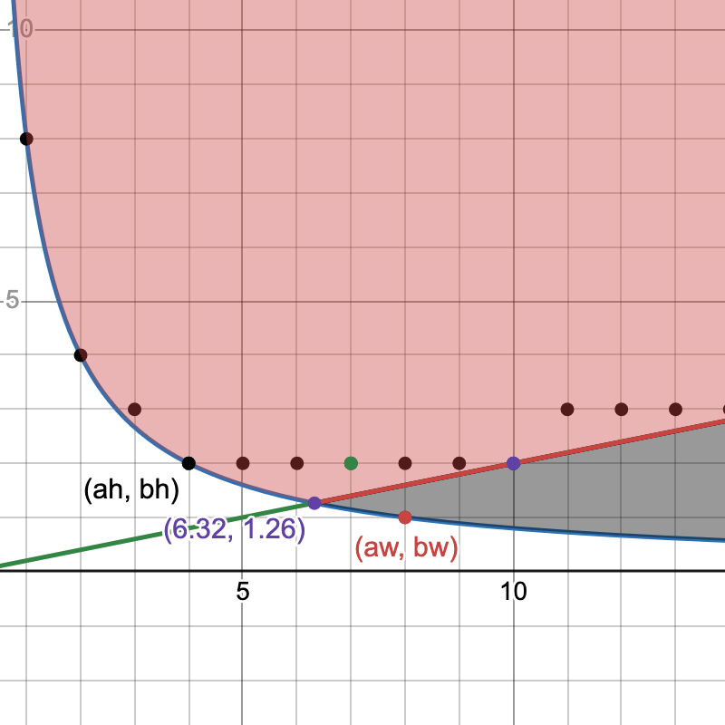</p>

This is the graph for the $n = 8, w = 10, h = 2$ example above, with $r = 10/2 = 5$. The black area under $y = rx$ contains all fit-width solutions, the red area all the fit-height solutions. The union of these two contains the entire solution space, all $(a, b)$ for which $n \le ab$, i.e. all grid dimensions which fit all squares. Points on the green-red line $x = ry$ are grid dimensions having the ratio exactly $r$. Black points are a subset of other solution candidates.

The symmetry of the problem with respect to ratio can now be directly visualized. For $n = 13$ and $r = 3$, respectively $r = 1/3$, we have:

<p style="display: flex; gap: 1em; justify-content: center">
    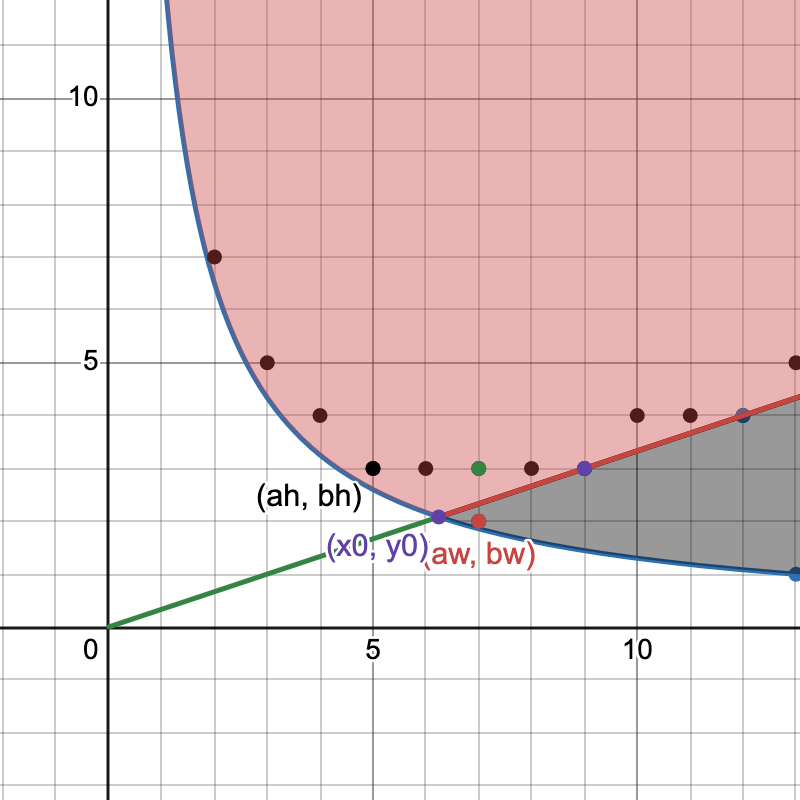 1 graph to depict symmetry of problem" width="300" />
    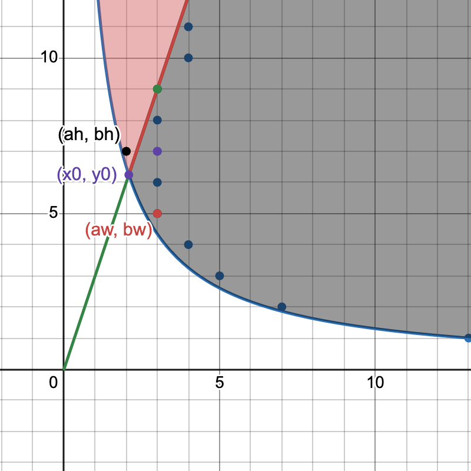
</p>

Terminology-wise, from here on $(a_w, b_w), (a_h, b_h)$ will be called a _fit-width point_, respectively a _fit-height point_, if the points respect the requirements in $\text{(9)}$; if the points are those described in $\text{(11)}$, they'll also be called _minimal points_ (minimized coordinates for maximal side-length). $s_w$ and $s_h$ will be called _fit-width_ and _fit-height solutions_; unless explicitly mentioned, the $(a_w, b_w), (a_h, b_h)$ points implied by $s_w$ and $s_h$ are not necessarily minimal. Sometimes only $a_w$ or $b_h$ will be mentioned but keep in mind that by definition they do have a pair $b_w$ and $a_h$.

Let's now analyze the solution space.

First, notice the purple point at the intersection of the hyperbola and the line – that is, the $(x_0, y_0)$ where $\frac{n}{y_0} = ry_0$ – is special. This would be the "ideal" point, if rows and columns could be fractional somehow: only these dimensions exactly fit all squares and have the exact desired ratio. Notice that:

$$\begin{equation} \tag{12}
x_0 = \frac{n}{y_0} = ry_0 \iff x_0 = \sqrt{rn} \land y_0 = \sqrt{\frac{n}{r}}
\end{equation}$$

The number of columns $a$ chosen in $\text{(2)}$ is precisely $\left\lceil x_0 \right\rceil$. This is the visual confirmation of that result: all the fit-width points will find themselves to the left of that point, all the fit-height points to its right. In other words:

$$\begin{equation} \tag{13}
\forall a_w, b_h\text{ . } a_w \ge x_0 \land b_h \ge y_0
\end{equation}$$

If parameters are "nice" such that $x_0, y_0 \in \N$ the minimal fit-width and fit-height points coincide (graph B):

<p id="graph-b" align=center>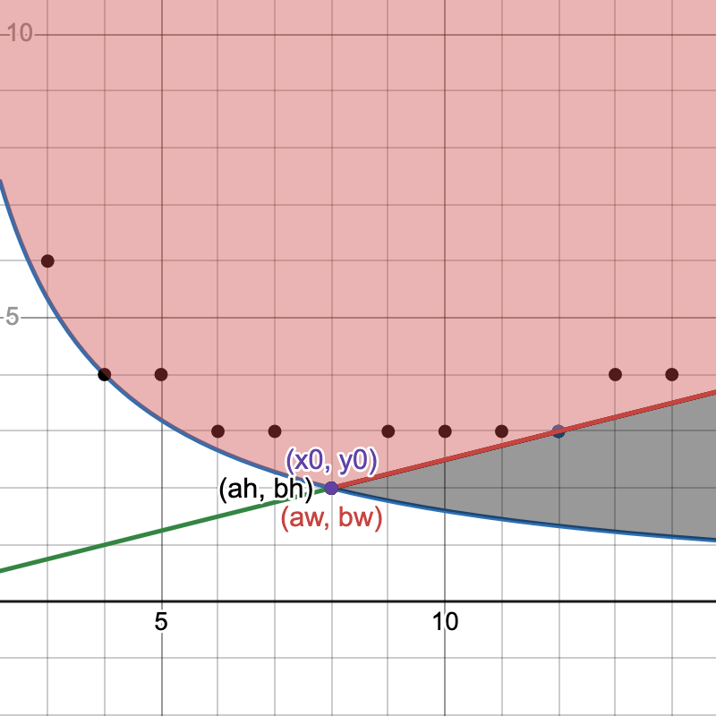</p>

Second, when is a point _valid_, i.e. satisfies solution requirements in $\text{(9)}$? Also, can multiple points give the same solution? Consider the following ($n = 23, r = 3.9$, graph C):

<p id="graph-c" align=center>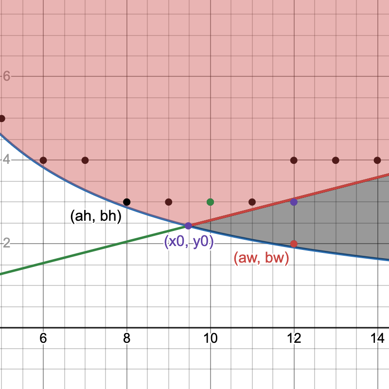</p>

The 4 points next to $(a_h, b_h)$ have the same ordinate and the point above $(a_w, b_w)$ the same abscissa, therefore their corresponding side lengths are still $s_h$, respectively $s_w$. This follows directly from the solution requirements in $\text{(9)}$:

$$\begin{equation} \tag{14}
\begin{split}
\begin{aligned}
\text{Fit width:} \\
a_wb_w \ge n \land a_w \ge rb_w \iff &\frac{n}{a_w} \le b_w \le \frac{a_w}{r} \\
    \iff &\left\lceil \frac{n}{a_w} \right\rceil \le b_w \le \left\lfloor \frac{a_w}{r} \right\rfloor \\
\text{Fit height:} \\
a_hb_h \ge n \land b_h \ge \frac{a_h}{r} \iff &\left\lceil \frac{n}{b_h} \right\rceil \le a_h \le \left\lfloor rb_h \right\rfloor
\end{aligned}
\end{split}
\end{equation}$$

We can add the ceiling and floor as a consequence of them being [residuated mappings](#and--are-residuated-mappings). Notice how the intervals describe the space between the hyperbola and the line for $a_h$ and $b_w$. Doesn't matter which value from these intervals $a_h$ and $b_w$ have, the solutions of $(a_w, b_w)$, $(a_h, b_h)$ are the same. The ceilings and floors are visible in the graph too: the points are a bit above/under the function graphs too. We can compress the inequality to get the validity condition:

$$\begin{equation} \tag{15}
\begin{split}
a_w \text{ valid }\iff &\left\lceil \frac{n}{a_w} \right\rceil \le \left\lfloor \frac{a_w}{r} \right\rfloor \\
b_h \text{ valid }\iff &\left\lceil \frac{n}{b_h} \right\rceil \le \left\lfloor rb_h \right\rfloor
\end{split}
\end{equation}$$

The number of points with equal solutions is easily derived by subtracting the interval endpoints.

Third, which points give the optimal solution $s$? How do they compare? Recall $\text{(10)}$:

$$\begin{align*}
s_w > s_h \iff a_w \lt rb_h
\end{align*}$$

From $\text{(9)}$ we know that for any $(a_h, b_h)$ fit-height point, $a_h \le rb_h$, meaning $rb_h$ is an upper bound on a fit-height solution's number of columns. Therefore:

> A fit-width point with less columns than _some_ fit-height point gives the better solution between the two.

If $rb_h \notin \N$ then both $a_w \le \lfloor rb_h \rfloor$ and $a_h \le \lfloor rb_h \rfloor$, meaning they can have at most as many columns. This is unsuprising: the fit-width solution stretches the columns fully, while the fit-height doesn't.

What about the number of rows? Since $a_w \ge rb_w$ we get that:

$$\begin{equation} \tag{16}
a_w \ge rb_w \land s_w > s_h \implies rb_w \le a < rb_h \implies b_w < b_h
\end{equation}$$

This means:

> A fit-width point must have less rows than a fit-height point to correspond to a better solution.

It makes sense intuitively: a fit-height solution stretches the rows fully, a fit-width doesn't; if a fit-width solution has as many rows or more, it must be worse.

We can observe these properties on the graphs above:
- in [graph A](#graph-a) the fit-width solution has less columns: it is the better one
- in [graph C](#graph-c) the fit-width solution has more columns: it is worse

Graph C shows that having less rows doesn't matter, since one can simply add more rows. Mathematically, for $(a_w, b_w)$ fit-width, $(a_h, b_h)$ fit-height points, if $s_w \le s_h$:

$$\begin{align*}
a_w \ge rb_h \ge a_h \land n \le a_hb_h \implies a_w \ge rb_h \land n \le a_wb_h \overset{\text{(9)}}{\implies} (a_w, b_h) \text{ fit-width}
\end{align*}$$

Note that all the results above apply for any $r$.

Fourth and finally, when $r \ge 1$ if the minimal fit-width solution is strictly better than any fit-height solution, then it corresponds [uniquelly to a single point (see appendix for proof)](#uniqueness-of-fit-width-solution-when). Symmetrically for $r \lt 1$ the same applies for the fit-height solution.

We can now analyze when the algorithm we've developed fails. Translating its solution to points:

$$\begin{align*}
P_a &= \begin{cases}
    (a_w = \left\lceil \sqrt{rn} \right\rceil, b_w = \left\lfloor{\frac{a_w}{r}}\right\rfloor)_{0} &\text{if } n \le a_wb_w \\
    (a_h = a_w, b_h = \left\lceil \frac{a_w}{r} \right\rceil)_{1} &\text{else}
\end{cases} \\
P_b &= \begin{cases}
    (a_h = \left\lfloor{rb_h}\right\rfloor, b_h = \left\lceil \sqrt{\frac{n}{r}} \right\rceil)_{0} &\text{if } n \le a_hb_h \\
    (a_w = \left\lceil rb_w \right\rceil, b_w = b_h)_{1} &\text{else}
\end{cases} \\
\end{align*}$$

Recall that if a fit-width point has a solution greater than that of a fit-height point it will have less rows. Above we can see that all of $P_{a,1}, P_{b,0}, P_{b,1}$ have a number of rows greater than $y_0$: for $P_b$ it is by construction, and for $P_{a,1}$:

$$\begin{align*}
\left\lceil \frac{a_w}{r} \right\rceil = \left\lceil \frac{\left\lceil \sqrt{rn} \right\rceil}{r} \right\rceil \ge \frac{\left\lceil \sqrt{rn} \right\rceil}{r} \ge \sqrt{\frac{n}{r}} = y_0
\end{align*}$$

Moreover, for $r \ge 1$ there exists a fit-height solution with $b_h = \left\lceil y_0 \right\rceil$ with probability greater than $1 - \frac{1}{2r}$ (over 75% for $r \ge 2$) and fit-width solutions with $a_w = \left\lceil x_0 \right\rceil$ are highly unlikely – in fact, almost never likely for $r \ge 2$ [(see appendix for proof)](#position-of-solution-points-relative-to). This means that the algorithm finds with very high guarantee the fit-height solution but rarely the fit-width one, if ever, even though the fit-width solution is most likely to be the optimal one.

Let's visualize this on the graphs of the two counterexamples given above ($r = 5, n = 8$ and $r = 3.5, n = 20$):

<p style="display: flex; gap: 1em; justify-content: center">
    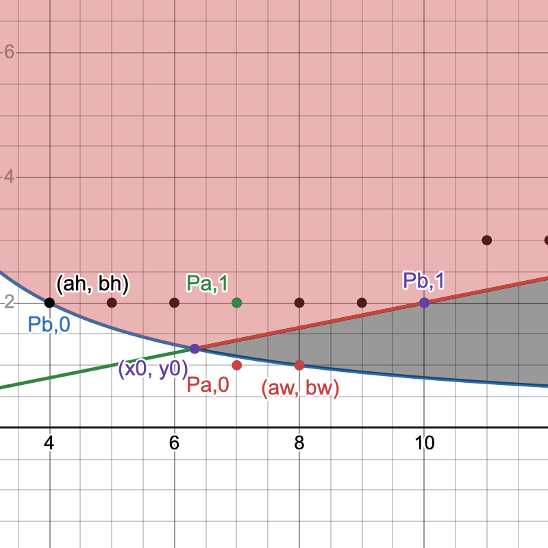
    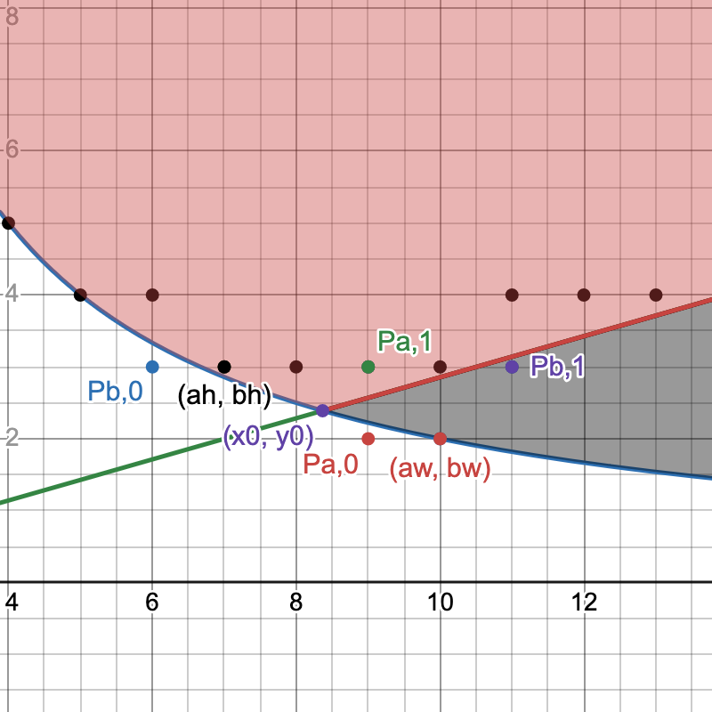
</p>

The initial fit-width point candidate $P_{a,0}$ is invalid in both cases (under the hyperbola), so the algorithm falls back to $P_{a,1}$, a fit-height point. In the first example, $P_{b,0}$ is already valid, so the fallback $P_{b,1}$ is not used; in the second, the fallback is used instead but even though it's a fit-width point its solution is equivalent to the fit-height solution, as they have the same number of rows. 

Let's now build a new algorithm. This algorithm should find the minimal fit-width and fit height points and pick the solution with the greater side length. Using $\text{(15)}$ , the solution we're looking for is:

$$\begin{gather*}
a_w = \min \Set{a \in \N : \left\lceil \frac{n}{a} \right\rceil \le \left\lfloor{\frac{a}{r}}\right\rfloor} \\
b_h = \min \Set{b \in \N : \left\lceil \frac{n}{b} \right\rceil \le \left\lfloor{rb}\right\rfloor} \\
s = \max \Set{ \frac{w}{a_w}, \frac{h}{b_h} }
\end{gather*}$$

Let's walk through how we translate this to code. First, we are looking for minimum $a_w$ and $b_h$; from $\text{(13)}$ we know that $a_w \ge \left\lceil \sqrt{rn} \right\rceil$ and $b \ge \left\lceil \frac{n}{r} \right\rceil$. We'll initialize variables `a` and `b` to those values. Then we need to ensure the validity condition; for that, we just increment `a` and `b` in a loop until the condition holds. The loops execute while $a_w$ and $b_h$ are invalid points:

$$\begin{equation} \tag{17}
\begin{split}
&\left\lceil\frac{n}{a}\right\rceil > \left\lfloor{\frac{a}{r}}\right\rfloor \iff a < r\left\lceil\frac{n}{a}\right\rceil \\
&\left\lceil\frac{n}{b}\right\rceil > \left\lfloor{rb}\right\rfloor \iff rb < \left\lceil\frac{n}{b}\right\rceil
\end{split}
\end{equation}$$

The implementation follows directly:

```javascript
const r = w / h

let a = Math.ceil(Math.sqrt(r * n))
for (; a < r * Math.ceil(n / a); a++);

let b = Math.ceil(Math.sqrt(n / r))
for (; r * b < Math.ceil(n / b); b++);

return Math.max(w / a, h / b);
```

The algorithm always terminates: as $a$ grows, $\left\lceil\frac{n}{a}\right\rceil$ decreases and $\left\lceil\frac{a}{r}\right\rceil$ increases, shrinking the interval until the ordering of its endpoints is swapped; likewise for $b$. The values at the end of each loop are minimal – we check every value one by one in ascending order.

Intuitively, if the loop condition holds there is no valid $(a_w, b_w)$ or $(a_h, b_h)$ fit-width, respectively fit-height point with the iteration's current $a_w$ or $b_h$ value. If we take $b_w = \left\lceil\frac{n}{a}\right\rceil$ and $a_h = \left\lceil\frac{n}{b}\right\rceil$ (the minimum values for a valid solution) we can imagine this algorithm as "walking away" from $(x_0, y_0)$ alongside the hyperbola until we (inevitably) find ourselves in the fit-width/fit-height solution spaces:

<p align=center>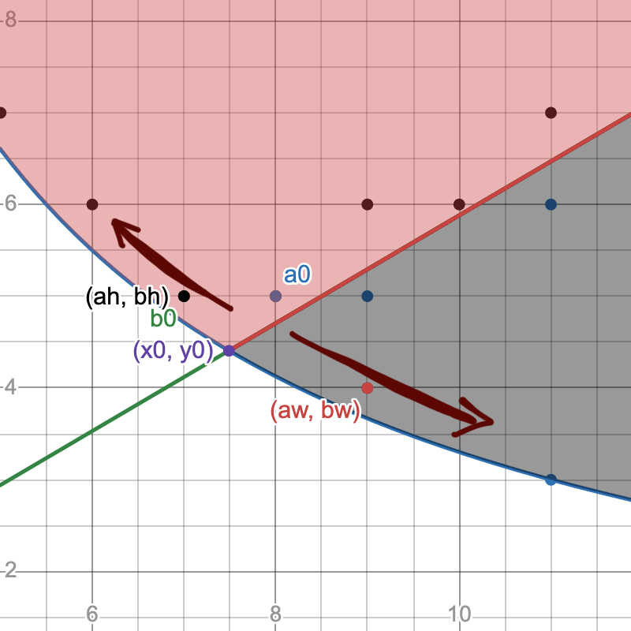</p>

$a_0$ and $b_0$ are the starting points, right next to $(x_0, y_0)$. The algorithm "walks down" to $(a_w, b_w)$ and "up" to $(a_h, b_h)$. In fact, in this example, $b_0$ is initialized directly to $(a_h, b_h)$; $a_0$ must be incremented once.

We have convinced ourselves of correctness. To analyze its runtime complexity, let's denote $a_0 = \left\lceil\sqrt{rn}\right\rceil$ the starting value of $a$. Since the loop condition is $a < r\left\lceil{\frac{n}{a}}\right\rceil$, $a$ will be incremented at most $\left\lceil{r\left\lceil{\frac{n}{a}}\right\rceil - a_0}\right\rceil$ times. Since $a$ increases $\left\lceil{\frac{n}{a}}\right\rceil \le \left\lceil{\frac{n}{a_0}}\right\rceil $. We can now count iterations:

$$\begin{equation} \tag{18}
\begin{split}
\left\lceil{r\left\lceil{\frac{n}{a}}\right\rceil - a_0}\right\rceil < \thickspace &r \left\lceil{\frac{n}{a_0}}\right\rceil - a_0 + 1 \\
    < \thickspace &r \frac{n}{a_0} + r -a_0 + 1 \\
    = \thickspace &r\frac{n}{\left\lceil \sqrt{rn} \right\rceil} + r - \left\lceil\sqrt{rn}\right\rceil + 1 \\
    < \thickspace &\frac{rn}{\sqrt{rn}} + r - \sqrt{rn} + 1 \\
    = \thickspace &r + 1
\end{split}
\end{equation}$$

This means at most $\left\lfloor r \right\rfloor + 1$ iterations and a runtime of $\mathcal{O}(r)$, dependent only on the aspect ratio of the grid. To show that the bound is tight, consider this following example:

<p align=center>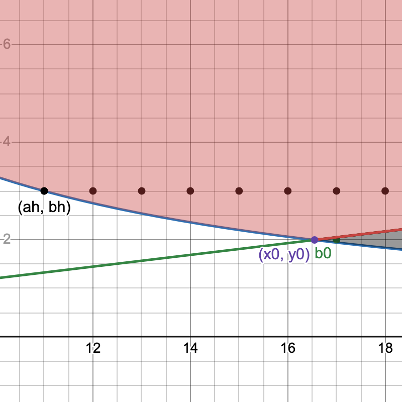</p>

Here $n = 33, r = 8.3$. A very rare case when the fit-height starting point $b_0$ is in the fit-width solution space. Consider the iteration count of the fit-height loop of the algorithm – by the same reasoning it is $\left\lfloor{\frac{1}{r}}\right\rfloor + 1$. It's visible that in this example the loop will do exactly 1 iteration to reach $(a_h, b_h)$. Since the algorithm is symmetric this proves tightness for the first loop by using the same $n$ and $r' = \frac{1}{r}$.

With a correct algorithm and good understang of why it works, we conclude here.

## Appendix

### Uniqueness of fit-width solution when $r \ge 1$

$\text{(9)}$ implies that for $b$ rows the minimal $a$ such that $(a, b)$ is a fit-width solution is:

$$\begin{gather*}
a = \max \Set{ \left\lceil{\frac{n}{b}}\right\rceil, \left\lceil{rb}\right\rceil }
\end{gather*}$$

Thus the minimal fit-width point is determined by:

$$\begin{equation} \tag{*}
a = \min_{b \in \N} \left\lceil\ \max \Set{ \frac{n}{b}, rb} \right\rceil
\end{equation}$$

This makes $a$ purely a function of $b$. This formula and a similar one for minimal fit-height solutions are used in [the Desmos visualizer][1] to plot minimal points for each $a$ and $b$ on the graph.

We now have all we need to begin the proof.

Assume towards a contradiction that there exist two $(a, b), (a, b')$ minimal fit-width points, $b < b'$, with $s_w > s_h$ for all fit-height points $(a_h, b_h)$. Assume $r \ge 1$.

Since the points are minimal, it follows from $\text{(*)}$ that:

$$\begin{align*}
a = \max\Set{ \left\lceil{\frac{n}{b}}\right\rceil, \left\lceil{rb}\right\rceil } = \max\Set{ \left\lceil{\frac{n}{b'}}\right\rceil, \left\lceil{rb'}\right\rceil }
\end{align*}$$

Without further deliberation, there are four situations we would have to tackle:
1. $a = \left\lceil rb \right\rceil = \left\lceil rb' \right\rceil$
1. $a = \left\lceil \frac{n}{b} \right\rceil = \left\lceil \frac{n}{b'} \right\rceil$
1. $a = \left\lceil rb \right\rceil = \left\lceil \frac{n}{b'} \right\rceil$
1. $a = \left\lceil \frac{n}{b} \right\rceil = \left\lceil rb' \right\rceil$

Intuitively, the first two shouldn't happen due to the monotonicity of $rx$ and $\frac{n}{x}$. The third one also shouldn't happen, since $(a, b)$ is around $(x_0, y_0)$, where $b' > b$ would imply $\frac{n}{b'} < rb$. Only the fourth case seems legitimate. Let's confirm our intuition formally.

Disproving case 1 is easy:

$$\begin{align*}
b < b' \implies rb < rb' \implies &rb < \underbrace{rb + 1 \le r(b + 1)}_{\text{from }r \ge 1} \le rb' \\
    \implies &\left\lceil rb \right\rceil \lt \left\lceil rb \right\rceil + 1 \le \left\lceil rb' \right\rceil \\
    \implies &\left\lceil rb \right\rceil < \left\lceil rb' \right\rceil \text{ contradiction}

\end{align*}$$

One would think disproving case 2 would be just as easy since it's still about monotonicity. Knowing that $r \ge 1$ helped tremendously above; doing the same for $\frac{n}{x}$ results in just $\left\lceil \frac{n}{b} \right\rceil \ge \left\lceil \frac{n}{b'} \right\rceil$. We need to get rid of the equality to actually have a contradiction, so let's find a sufficient condition for strict inequality:

$$\begin{align*}
b < b' \implies \frac{n}{b} > \frac{n}{b'} \implies &\frac{n}{b} > \frac{n}{b + 1} \ge \frac{n}{b'} \\
\overbrace{\frac{n}{b} \ge \frac{n}{b + 1} + 1}^{\text{condition candidate}} > \frac{n}{b + 1} \ge \frac{n}{b'} \implies &\left\lceil \frac{n}{b} \right\rceil \ge \left\lceil \frac{n}{b + 1} \right\rceil + 1 \ge \left\lceil \frac{n}{b'} \right\rceil \\
\implies &\left\lceil \frac{n}{b} \right\rceil > \left\lceil \frac{n}{b'} \right\rceil
\end{align*}$$

Perfect! When does this happen?

$$\begin{align*} \tag{**}
\frac{n}{b} \ge \frac{n}{b + 1} + 1 \iff &\frac{n - b}{b} \ge \frac{n}{b + 1} \\
    \iff &b^2 + b - n \le 0 \\
    \iff &b \le \frac{\sqrt{1 + 4n} - 1}{2} \\
    \overset{\text{rm.}}{\iff} &b \le \left\lfloor{\sqrt{\frac{1}{4} + n} - \frac{1}{2}}\right\rfloor
\end{align*}$$

Great. (I'm marking usage of [residuated mapping properties](#and--are-residuated-mappings) with $\text{rm.}$ since it's a subtle change easy to misuse). Is our $b$ smaller than that?

$$\begin{align*}
a = \left\lceil \frac{n}{b'} \right\rceil \overset{\text{(*)}}{\implies} \left\lceil \frac{n}{b'} \right\rceil \ge \left\lceil rb' \right\rceil \implies &\left\lceil \frac{n}{b'} \right\rceil \ge \overbrace{rb' \ge b'}^{r \ge 1} \\
    \implies &\frac{n}{b'} + 1 > b' \\
    \implies &b'^2 - b' - n < 0 \\
    \implies &b' < \frac{\sqrt{1 + 4n} + 1}{2} \\
    \overset{\text{rm.}}{\implies} &b' \le \left\lfloor{\sqrt{\frac{1}{4} + n} + \frac{1}{2}}\right\rfloor
\end{align*} \\
\begin{align*}
b < b' \implies &b \le \left\lfloor{\sqrt{\frac{1}{4} + n} + \frac{1}{2}}\right\rfloor - 1 \\
    \implies &b \le \left\lfloor{\sqrt{\frac{1}{4} + n} - \frac{1}{2}}\right\rfloor \\
    \overset{\text{(**)}}{\implies} &\frac{n}{b} \ge \frac{n}{b + 1} + 1 \\
    \implies &\left\lceil \frac{n}{b} \right\rceil > \left\lceil \frac{n}{b'} \right\rceil \text{ contradiction}
\end{align*}$$

Yes, disproven! We can proceed with a counterproof for case 3, which is trivial:

$$\begin{align*}
a = \left\lceil \frac{n}{b'} \right\rceil \overset{\text{(*)}}{\implies} &\left\lceil \frac{n}{b'} \right\rceil \ge \left\lceil rb' \right\rceil \\
    \implies &\left\lceil \frac{n}{b} \right\rceil \ge \left\lceil \frac{n}{b'} \right\rceil \ge \overbrace{\left\lceil rb' \right\rceil > \left\lceil rb \right\rceil}^{\text{strict, see case 1}} \\
    \implies & \left\lceil \frac{n}{b} \right\rceil > \left\lceil rb \right\rceil \\
a = \left\lceil rb \right\rceil \overset{\text{(*)}}{\implies} &\left\lceil \frac{n}{b} \right\rceil \le \left\lceil rb \right\rceil \text{ contradiction}
\end{align*}$$

Finally we are left with only case 4, $a = \left\lceil rb' \right\rceil = \left\lceil \frac{n}{b} \right\rceil$, the only one speculated to make sense.

To get an idea of what to prove, look at [graph C](#graph-c) again: there are two minimal fit-width points with equivalent solutions. Those points do not give the best solution: $a_w = 12 > rb_h = 3.9 \cdot 3$. Notice that one solution has $b_w = b_h$. Empirical observation on multiple parameters seems to always exhibit this, so let's prove that there is _always_ an equivalent or better fit-height solution if $(a, b), (a, b')$ as chosen above are valid solutions.

Let's begin: since $(a, b)$ and $(a, b')$ are fit-width solutions, by $\text{(9)}$ the following holds:

$$\begin{equation} \tag{***}
\begin{split}
&n \le ab \land a \ge rb \\
&n \le ab' \land a \ge rb'
\end{split}
\end{equation}$$

Let $(a_h = \left\lceil \frac{n}{b'} \right\rceil, b_h = b')$. For $(a_h, b_h)$ to be a valid fit-height point, $\text{(15)}$ must hold true:

$$\begin{align*}
    \left\lceil \frac{n}{b'} \right\rceil \le \left\lfloor rb' \right\rfloor
\end{align*}$$

Whether $rb'$ is an integer or not changes the ceiling and floor result. Starting with $rb' \in \N$:

$$\begin{align*}
rb' \in \N \implies &a = rb' \\
    \overset{\text{(***)}}{\implies} &n \le brb' \\
    \implies &\frac{n}{b'} \le rb < rb' \\
    \overset{\text{rm.}}{\implies} &\left\lceil \frac{n}{b'} \right\rceil \le \left\lfloor rb' \right\rfloor = rb'
\end{align*}$$

It holds. For $rb' \notin \N$ let now $F = \left\lfloor rb' \right\rfloor$ and recall that $b' \ge b + 1 > b$ by assumption. Then:

$$\begin{gather*}
\begin{align*}
(i) \enspace &a = \left\lceil rb' \right\rceil = F + 1 \\
(ii) \ &F = \left\lfloor rb' \right\rfloor \ge \underbrace{\left\lfloor r(b + 1) \right\rfloor \ge b + 1}_{r \ge 1} \implies \frac{F}{b + 1} \ge 1 \\[2em]
& \begin{align*}
\frac{n}{b'} \overset{\text{(***)}}{\le} \frac{ab}{b'} &\overset{\text{(i)}}{=} \frac{(F + 1)b}{b'} \\
    &\le \frac{(F + 1)b}{b + 1} \\
    &= F\frac{b}{b + 1} + \frac{b}{b + 1} \\
    &= F\frac{(b + 1) - 1}{b + 1} + \frac{b}{b + 1} \\
    &= F - \frac{F}{b + 1} + \underbrace{\frac{b}{b + 1}}_{<1} \\
    &\overset{\text{(ii)}}{\le} F - 1 + 1 = F
\end{align*} \\
&\begin{align*}
\frac{n}{b'} \le F \overset{\text{rm.}}{\iff} &\left\lceil \frac{n}{b'} \right\rceil \le \left\lfloor rb' \right\rfloor
\end{align*}
\end{align*}
\end{gather*}$$

With this we have shown that $\text{(15)}$ holds for $(a_h = \left\lceil \frac{n}{b'} \right\rceil, b_h = b')$, meaning that $(a_h, b_h)$ is a valid fit-height point. We assumed at the beginning that $s_w > s_h$. But by $\text{(***)}$:

$$\begin{align*}
a \ge rb' \iff \frac{1}{a} \le \frac{1}{rb_h} \iff s_w \le s_h \text{ contradiction}
\end{align*}$$

All four cases contradict our assumptions. In conclusion, if $(a, b)$ is a minimal fit-width point with $s_w > s_h$ for all valid fit-height $(a_h, b_h)$ points, it must be unique.

Fun fact: the idea for disproving case 2 came from the intuition that since $n = \sqrt{n}^2$, dividing $n$ by $b < b' < \sqrt{n}$ should mostly produce distinct results, as the value grows quicker and quicker as $b$ approaches zero. $\text{(**)}$ implies exactly that:

$$\begin{align*}
b \le \left\lfloor{\sqrt{\frac{1}{4} + n} - \frac{1}{2}}\right\rfloor \le \left\lfloor{\sqrt{(\frac{1}{2} + \sqrt{n})^2} - \frac{1}{2}}\right\rfloor = \left\lfloor \sqrt{n} \right\rfloor
\end{align*}$$

### Position of solution points relative to $(x_0, y_0)$

We'll approach this subject by handling fit-height points where $r \ge 1$. Due to the symmetry of the problem relative to ratio, we can make more general conclusions afterwards.

$b = \lceil y_0 \rceil = \left\lceil{\sqrt{\frac{n}{r}}}\right\rceil$ is a valid fit-height point by $\text{(15)}$ if and only if:

$$\begin{align*}
\left\lceil{\frac{n}{b}}\right\rceil \le \left\lfloor{rb}\right\rfloor
\end{align*}$$

A sufficient condition is:

$$\begin{align*}
rb - \frac{n}{b} \ge 1 \implies &rb^2 -n - b \ge 0 \\
    \implies &b \ge \frac{1}{2r} + \sqrt{\frac{1}{4r^2} + \frac{n}{r}} > \sqrt{\frac{n}{r}}
\end{align*}$$

If $b$ is greater than that the fit-height point $(a, b)$ is valid. The bound doesn't cover all cases when $\exist k \in \N \text{ . } k \in [\frac{n}{b}, rb]$ (e.g. when $y_0 \in \N$ then the point valid for every $n$) but it is easy to _quanitfy_. We can use it to answer: for fixed $r \ge 1$ what's the probability for $b$ to be a valid fit-height solution?

To do this, observe that by the properties of ceiling, $\sqrt{\frac{n}{r}} \le b \lt \sqrt{\frac{n}{r}} + 1$. We can bound the expression above likewise, using $r \ge 1$:

$$\begin{align*}
    \sqrt{\frac{n}{r}} < \frac{1}{2r}+\sqrt{\frac{1}{4r^2}+\frac{n}{r}} < \frac{1}{2} + \sqrt{\left(\frac{1}{2} + \sqrt{\frac{n}{r}}\right)^2} = \sqrt{\frac{n}{r}} + 1
\end{align*}$$

It follows that:

$$\begin{align*}
\sqrt{\frac{n}{r}} < \frac{1}{2r} + \sqrt{\frac{1}{4r^2}+\frac{n}{r}} \le b = \left\lceil{\sqrt{\frac{n}{r}}}\right\rceil < \sqrt{\frac{n}{r}} + 1
\end{align*}$$

If we subtract $\sqrt{\frac{n}{r}}$, the difference will be always between $0$ and $1$:

$$\begin{align*}
0 < \underbrace{\frac{1}{2r} + \sqrt{\frac{1}{4r^2}+\frac{n}{r}} - \sqrt{\frac{n}{r}}}_{B_r(n)} \le \underbrace{\left\lceil{\sqrt{\frac{n}{r}}}\right\rceil - \sqrt{\frac{n}{r}}}_{C_r(n)} < 1
\end{align*}$$

Let's visualize this:

<p style="display: flex; gap: 1em; justify-content: center">
    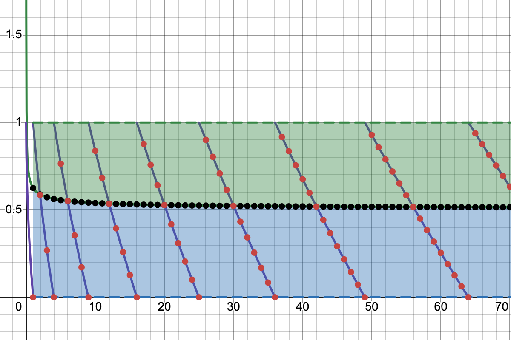
    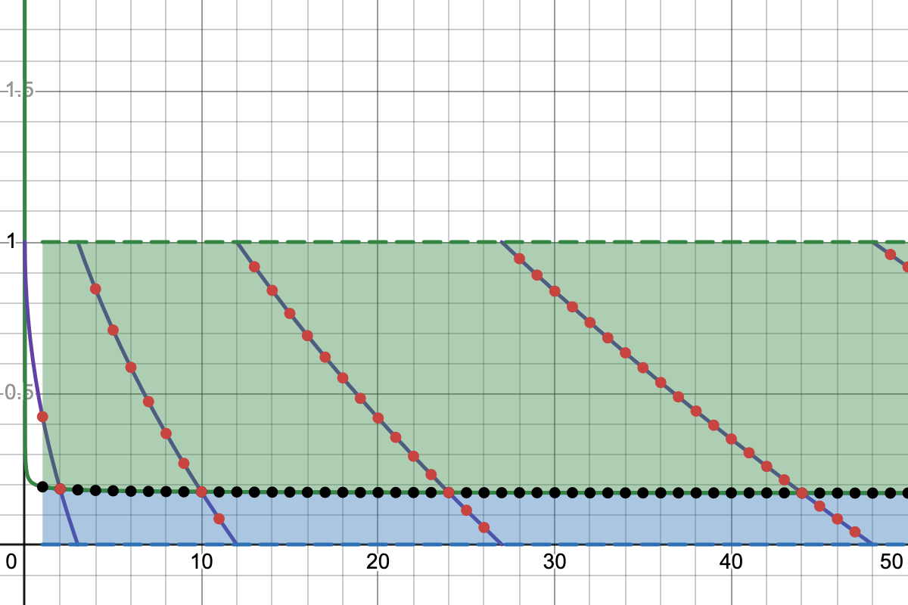
</p>

First graph depicts $r = 1$, the second $r = 3$. The red points represent $C_r(n)$, the black points $B_r(n)$. Whenever a red point is in the green area $C_r(n) \ge B_r(n)$, meaning $\left\lceil{\sqrt{\frac{n}{r}}}\right\rceil$ is a valid fit-height point for $n$. The points where $C_r(n) = 0$ are ignored because that means that the corresponding $b$ is an integer and thus a valid point.

Since this criterion doesn't cover all possibilities, the probability that $b$ is a valid point up to a certain $n$ of choice is greater than or equal to the number of points in the green area divided by the total number of points:

$$\begin{align*}
P_r \ge \lim_{n \to \infin} \frac{\left|\Set{k \in [n] : C_r(k) \ge B_r(k)}\right|}{\left|\Set{k \in [n] : C_r(k) > 0}\right|} \qquad
\end{align*}$$

We can approximate by counting points up to a certain $n$. For example $P_{1,n=10} \ge \frac{4}{7} \approx 0.571$ and $P_{3,n=26} \ge \frac{21}{24} = 0.875$.

But we can't count to infinity. Luckily, $C(n)$ is [equidistributed modulo 1](https://en.wikipedia.org/wiki/Equidistributed_sequence#Equidistribution_modulo_1): the points $(n, C_r(n))$ are [uniformly distributed](https://en.wikipedia.org/wiki/Continuous_uniform_distribution) between the two green and blue areas, proportionally with their sizes. This enables us to just compute the ratio of the solution area to the total area, which is the complement of $B_r(x)$'s area within $(0, 1)$.

To compute this, let's bound $B_r(n)$ first:

$$\begin{align*}
\frac{1}{2r} \le B_r(n) &= \frac{1}{2r} + \sqrt{\frac{1}{4r^2}+\frac{n}{r}} - \sqrt{\frac{n}{r}} \\
    &= \frac{1}{2r} + \sqrt{\frac{n}{r}}\left(\sqrt{1 + \frac{1}{4rn}} - 1\right) \\
    &\le \frac{1}{2r} + \sqrt{\frac{n}{r}}\cdot\frac{1}{8rn} \\
    &= \frac{1}{2r}+\frac{1}{8r\sqrt{rn}}
\end{align*}$$

The approximation $\sqrt{1 + x} \le 1 + \frac{x}{2}$ was used. We can observe the following:

$$\begin{align*}
\lim_{x \to \infin}B_r(x) = \frac{1}{2r} \qquad \displaystyle\int_{1}^{\infin}B_r(x)dx = \infin
\end{align*}$$

where the integral is the area under $B_r(x)$. We can now compute the probability:

$$\begin{align*}
P_r \ge 1 - \lim_{x \to \infin}\frac{\displaystyle\int_{1}^{x}B_r(n)dn}{\int_{1}^{x}1} = 1 - \lim_{x \to \infin}B_r(x) = 1 - \frac{1}{2r}
\end{align*}$$

Since we are in the $\frac{\infin}{\infin}$ indeterminate form l'Hôpital was applied, avoiding integration. Thus, for the examples above $P_1 \ge 0.5$ and $P_3 \ge 0.833$.

The first conclusion is that fit-height solutions will for the most part have $b_h = \left\lceil{\sqrt{\frac{n}{r}}}\right\rceil$. We can derive even more interesting information by looking at the graph for $r < 1$:

<p align=center>
    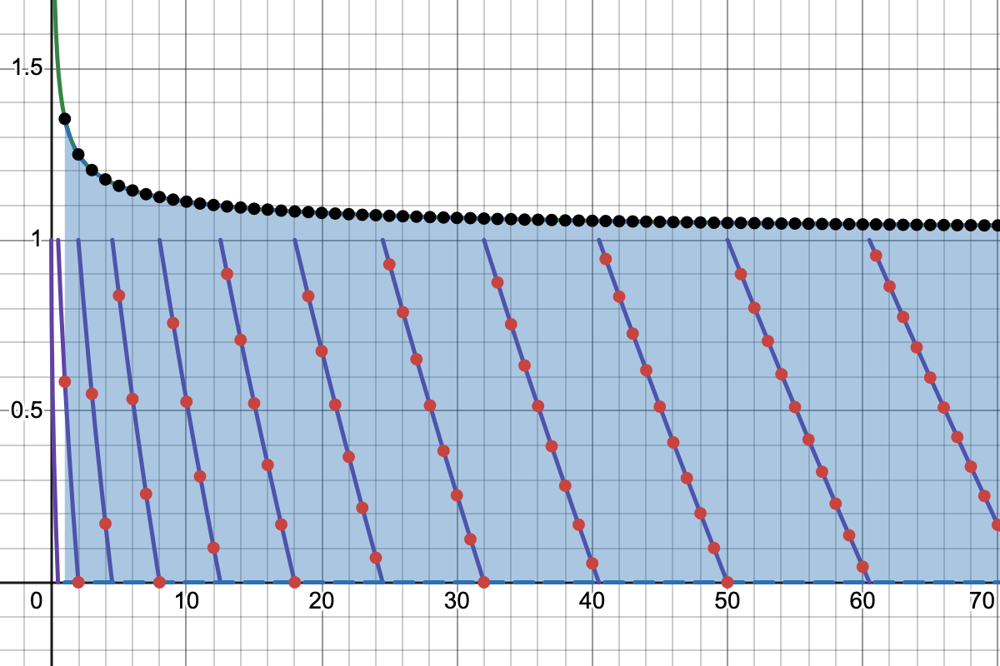
</p>

Note that $r < 1$ means we've essentially flipped dimensions: the fit-height points correspond to the fit-width points of ratio $ \frac{1}{r}$. For $r = \frac{1}{2}$ as depicted above, $P_{\frac{1}{2}} \ge 0$. How do we interpret this?

> For $r \ge 2$, no a = $\left\lceil{\sqrt{rn}}\right\rceil$ satisfies the sufficient condition above to fulfill the fit-width solution requirements.

Any valid $a_w$ will be greater than $\left\lceil{x_0}\right\rceil$ with very high certainty, especially when considering the growth rate of $\frac{1}{2r}$ as $r \to 0$. This also provides an intuitive explanation for the second algorithm's runtime: as $r$ grows the fit-width solutions are farther and farther away from $(x_0, y_0)$, so the first loop will have to iterate more; at the same time, the probability that the initial fit-height solution candidate is valid rapidly increases, which prevents the second loop from iterating.

The final conclusion is: for $r \ge 1$ it is very likely that $b_h = \left\lceil{\sqrt{\frac{n}{r}}}\right\rceil$ is a valid fit-height point and almost never likely that $a_w = \left\lceil{\sqrt{rn}}\right\rceil$ is a valid fit-width point. Then mostly $b_w < b_h$, since with more columns the grid requires less rows to fit all squares. Therefore by $\text{(17)}$ for $r \ge 1$ _the fit-width solution is in the majority of cases better than any fit-height solution_. Likewise for $r < 1$ but with fit-width and fit-height swapped.

### Using binary search in the second algorithm

According to $\text{(18)}$ the algorithm always finds a solution after $\left\lfloor{r}\right\rfloor+ 1$ iterations, thus $a_0 \le a_w \lt a_0 + r + 1$, where $a_0 = \left\lceil \sqrt{rn} \right\rceil$ is the starting value for $a_w$.

We can binary search over that interval using the same loop condition from $\text{(17)}$. If the midpoint is not a valid $a_w$, we search in the upper half, since we're not yet in the solution space, otherwise we search in the lower half, since we want the minimal solution. Here is the algorithm for $a_w$:

```javascript
const r = w / h

let left = Math.ceil(Math.sqrt(r * n))
let right = Math.ceil(left + r + 1)

while (left < right) {
    const mid = Math.floor(left + (right - left) / 2)
    if (mid < r * Math.ceil(n / mid)) {
        left = mid + 1
    } else {
        right = mid 
    }
}

return w / left
```

Upper bound ceiled so interval is open. `left` stores $a_w$. This reduces the asymptotic runtime to $\mathcal{O}(\log r)$. Useful for very large ratios but very large ratios seem utterly useless.

### $\left\lfloor \cdot \right\rfloor$ and $\left\lceil \cdot \right\rceil$ are residuated mappings

This means that, for $\forall x \in \R, n \in \N$:
1. $n \le x \iff n \le \left\lfloor x \right\rfloor$
1. $x \le n \iff \left\lceil x \right\rceil \le n$
1. $n < x \iff n < \left\lceil x \right\rceil$
1. $x < n \iff \left\lfloor x \right\rfloor < n$

To prove the first, if $x \in \N$ then clearly $n \le \left\lfloor x \right\rfloor = x$, else if $x \in \R \setminus \N$:

$$\begin{align*}n \le x \iff n < x \iff &n < \left\lfloor x \right\rfloor + \{x\} \\ \iff &n \le \left\lfloor x \right\rfloor \lor (\left\lfloor x \right\rfloor < n < \left\lfloor x \right\rfloor + \{x\}) \\ \overset{\{x\} < 1}{\iff} &n \le \left\lfloor x \right\rfloor \lor (\left\lfloor x \right\rfloor < n < \left\lfloor x \right\rfloor + 1) \\ \overset{n \in \N}\iff &n \le \left\lfloor x \right\rfloor \end{align*}$$

To prove the second, if $x \in \N$ then clearly $x = \left\lceil x \right\rceil \le n$, else if $x \in \R \setminus \N$:

$$\begin{align*} x \le n \iff x < n \iff &\left\lfloor x \right\rfloor + \{x\} < n \\ \iff &\{x\} < n - \left\lfloor x \right\rfloor \\ \iff & 1 \le n - \left\lfloor x \right\rfloor \\ \iff & \left\lfloor x \right\rfloor + 1 \le n \\ \iff & \left\lceil x \right\rceil \le n\end{align*}$$

The others are proven in a similar fashion. Read more about this on [Wikipedia's "Equivalences" for floor and ceiling](https://en.wikipedia.org/wiki/Floor_and_ceiling_functions#Equivalences). These are standard properties but I insisted on writing them here as a "note to self" since I've confused myself and applied them wrong way too many times. I probably know that Wikipedia page now by heart.

[1]: https://www.desmos.com/calculator/8y5xph34oc